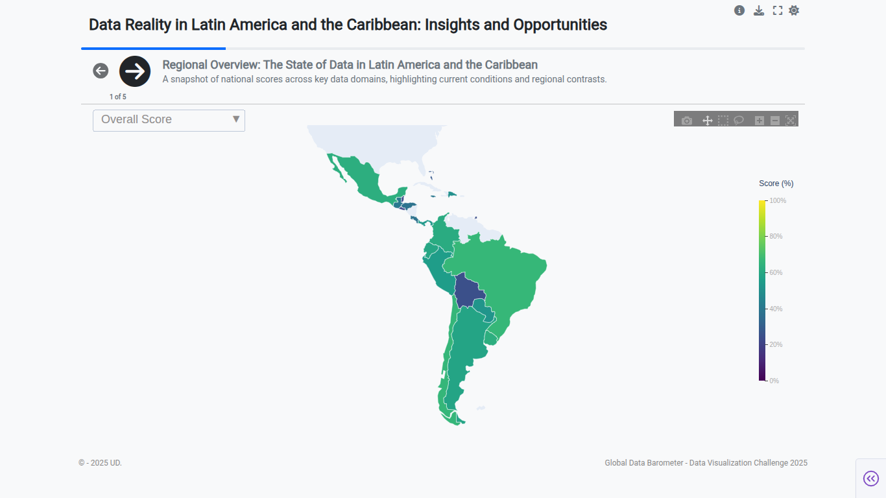
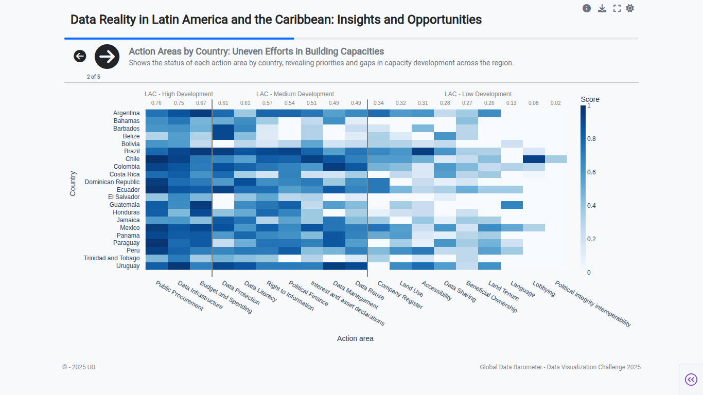
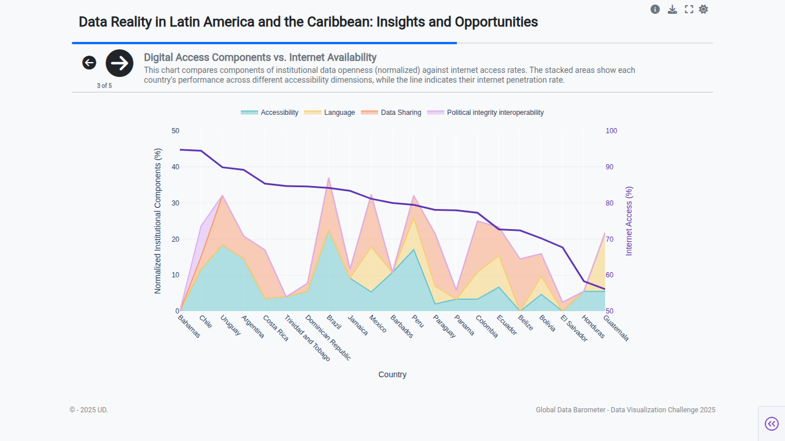
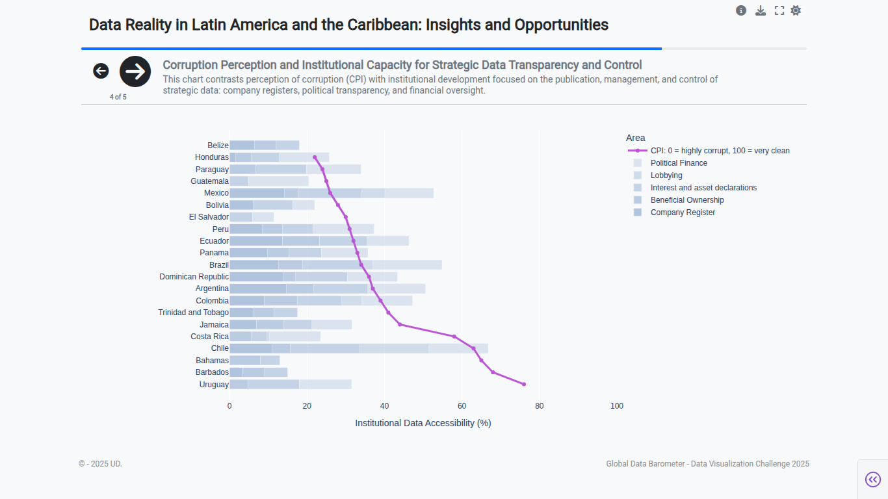

# GDB_2025

# Data Reality in Latin America and the Caribbean

## Description

This project presents a visual and narrative analysis of the state of data in Latin America and the Caribbean (LAC), based on key indicators from the Global Data Barometer and complementary data such as internet access and the Corruption Perception Index (CPI). The goal is to provide clear insights into institutional capacities, digital accessibility, and opportunities to improve transparency and control.

## Content

- Interactive visualizations and charts showcasing the regional landscape.
- Analysis of action areas and institutional capacities by country.
- Relationship between digital access, corruption perception, and institutional development.
- Summary of key findings and opportunities for the region.

## Slide Structure

1. Regional overview with score maps.
2. Status by action areas shown in a heatmap.
3. Comparison between institutional accessibility components and internet access.
4. Relationship between corruption perception and institutional capacity for transparency.
5. Final summary with findings and opportunities.

---

## Technologies

- Visualization tools (Plotly, Dash).
- Python for data processing and analysis.

---

## Deployment Instructions

```bash
# Clone the repository
git clone https://github.com/U-Danny/GDB_2025.git
cd GDB_2025

# Install dependencies
pip install -r requirements.txt

# Run the application
python app.py

```

---

## Screenshots

### Below are some screenshots of the application interface:

<div style="display: flex; flex-wrap: wrap; gap: 10px; justify-content: center;">      </div>

---

## Contributing

### Contributions are welcome! Feel free to open issues or submit pull requests for improvements.

License

### MIT License
